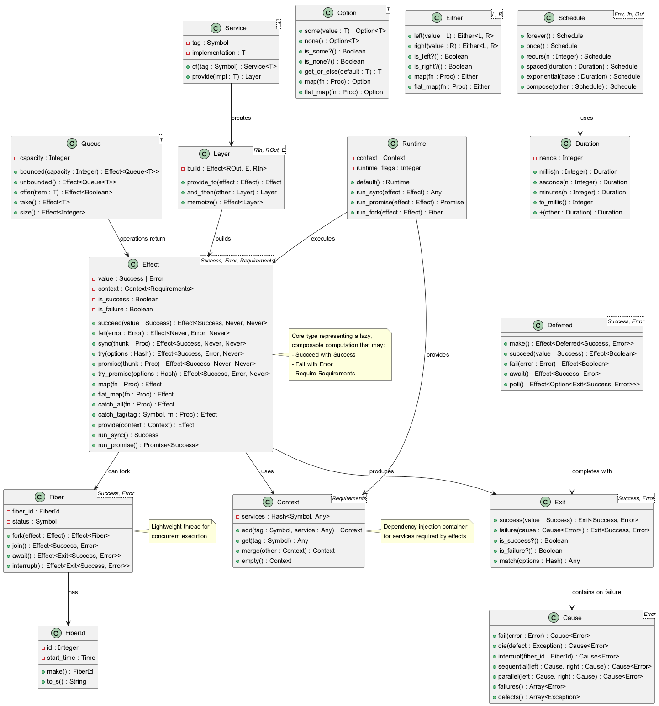
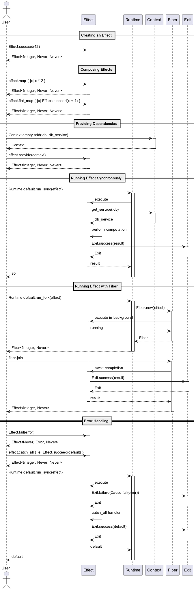

# Ruby-Effect: A Functional Effect System for Ruby

[](https://badge.fury.io/rb/ruby-effect)
[](https://github.com/ruby-effect/ruby-effect/actions/workflows/ci.yml)

**Ruby-Effect** is a powerful Ruby gem that brings the principles of functional effect systems to the Ruby ecosystem, heavily inspired by the design and architecture of the [Effect-TS](https://effect.website/) library for TypeScript. It provides a robust framework for building composable, type-safe, and resilient applications by explicitly managing side effects, errors, and dependencies.

This library empowers developers to write code that is easier to reason about, test, and maintain by separating the description of a program from its execution. By modeling computations as immutable `Effect` values, you can build complex, asynchronous, and concurrent workflows with confidence.

## Core Concepts

The central idea behind Ruby-Effect is the `Effect` data type, which represents a computation that may succeed, fail, or require external dependencies to run. An `Effect` is a lazy and immutable description of a workflow.

### The Effect Type

An `Effect` is a generic type with three parameters:

```ruby
Effect<Success, Error, Requirements>
```

- **Success**: The type of value the effect produces upon successful execution.
- **Error**: The type of error the effect can fail with.
- **Requirements**: The set of services or dependencies the effect needs to run.

This structure allows the type system to track all possible outcomes of a computation, making error handling explicit and eliminating unexpected runtime exceptions.

### Key Features

| Feature | Description |
|---|---|
| **Declarative & Composable** | Build complex workflows by combining small, reusable effects. |
| **Explicit Error Handling** | Errors are tracked in the type system, forcing you to handle them. |
| **Dependency Injection** | Manage dependencies with a powerful `Context` and `Layer` system. |
| **Concurrency** | Lightweight concurrency model using `Fiber`s for parallel execution. |
| **Resource Safety** | Safely manage resources with guaranteed acquisition and release. |
| **Asynchronous Operations** | Write synchronous-looking code for asynchronous workflows. |

## Architecture Overview

The architecture of Ruby-Effect is designed to be modular and extensible. The following diagrams illustrate the core components and their interactions.

### Class Diagram

This diagram shows the main classes and their relationships, providing a high-level overview of the library's structure.



### Sequence Diagram

This diagram illustrates the typical execution flow of an `Effect`, from creation to running it with the `Runtime`.



## Installation

Add this line to your application's Gemfile:

```ruby
gem 'ruby-effect'
```

And then execute:

```bash
$ bundle install
```

Or install it yourself as:

```bash
$ gem install ruby-effect
```

## Usage Examples

### Creating Effects

Create effects using the factory methods provided by the `Ruby::Effect` module.

```ruby
require 'ruby/effect'

# Effect that succeeds with a value
success_effect = Ruby::Effect.succeed(42)

# Effect that fails with an error
failure_effect = Ruby::Effect.fail("Something went wrong")

# Effect from a synchronous computation
sync_effect = Ruby::Effect.sync { puts "Hello, World!"; 1 + 1 }

# Effect from a computation that might raise an exception
try_effect = Ruby::Effect.try { 10 / 0 }
```

### Composing Effects

Use `map` and `flat_map` to build complex workflows from simpler effects.

```ruby
# Transform the success value
doubled_effect = Ruby::Effect.succeed(5).map { |x| x * 2 } # => Effect<10, ...>

# Chain effects together
chained_effect = Ruby::Effect.succeed(3).flat_map do |x|
  Ruby::Effect.succeed(x * 3)
end # => Effect<9, ...>
```

### Error Handling

Handle errors explicitly using `catch_all` and other recovery methods.

```ruby
recovered_effect = Ruby::Effect.fail("error").catch_all do |error|
  Ruby::Effect.succeed("Recovered from: #{error}")
end

# Retry an effect with a schedule
retried_effect = Ruby::Effect.try { ... }.retry(Ruby::Effect::Schedule.exponential(Duration.seconds(1)))
```

### Dependency Injection

Manage dependencies using `Context` and `Service`.

```ruby
# Define a service tag
MyService = Ruby::Effect::Service.of(:my_service)

# Create an effect that requires the service
app = MyService.flat_map do |service|
  Ruby::Effect.sync { service.perform_action }
end

# Provide the service implementation
my_service_impl = MyServiceImpl.new
runtime = Ruby::Effect::Runtime.default.with_context(
  Ruby::Effect::Context.empty.add(MyService.tag, my_service_impl)
)

# Run the application
runtime.run_sync(app)
```

### Concurrency

Run effects concurrently using `Fiber`s.

```ruby
effect1 = Ruby::Effect.sync { sleep 1; "one" }
effect2 = Ruby::Effect.sync { sleep 1; "two" }

# Run effects in parallel
parallel_effect = Ruby::Effect.all([effect1, effect2])

result = parallel_effect.run_sync # => ["one", "two"]
```

## Development

After checking out the repo, run `bin/setup` to install dependencies. Then, run `rake spec` to run the RSpec tests and `bundle exec cucumber` to run the Cucumber features.

You can also run `bin/console` for an interactive prompt that will allow you to experiment.

To install this gem onto your local machine, run `bundle exec rake install`.

## Contributing

Bug reports and pull requests are welcome on GitHub at [https://github.com/ruby-effect/ruby-effect](https://github.com/ruby-effect/ruby-effect). This project is intended to be a safe, welcoming space for collaboration, and contributors are expected to adhere to the [code of conduct](CODE_OF_CONDUCT.md).

## License

The gem is available as open source under the terms of the [MIT License](https://opensource.org/licenses/MIT).

## References

- [Effect-TS Official Website](https://effect.website/)

